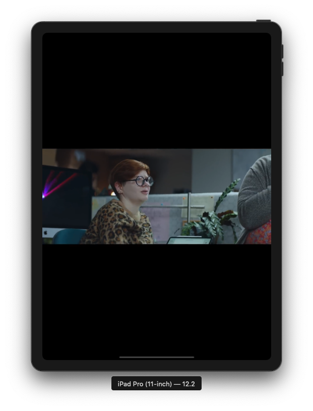

# Picture in Picture App
Adopting Picture in Picture (PiP) in a Custom Player - Swift Language

## Working with Picture in Picture (iOS)

Picture in Picture (PiP) playback was introduced in iOS 9. It lets iPad users play video in a moveable, resizable window that floats over the apps onscreen. It brings a new level of multitasking capabilities to the iPad, enabling users to continue playback while performing other activities on their devices. This feature is found in Apple’s built-in video playback apps, and is available to your apps through the AVKit framework.  

Applications that support PiP playback present a small button in the lower-right corner of the video playback window. Tapping this button minimizes the video display to a small floating window, letting the user perform other activities in the primary application or even in another application.   

## Application Demo

   

## Blog Post

- [How to use Picture in Picture (PiP) in Swift](https://medium.com/@halilozel1903/how-to-use-picture-in-picture-pip-in-swift-585a59f6cc8c)

## Resources

- [Swift Video Tutorial](https://www.youtube.com/watch?v=PNCtRRusgDA)  

- [Using AVKit Platform Features](https://developer.apple.com/library/archive/documentation/AudioVideo/Conceptual/MediaPlaybackGuide/Contents/Resources/en.lproj/UsingAVKitPlatformFeatures/UsingAVKitPlatformFeatures.html#//apple_ref/doc/uid/TP40016757-CH5-SW3)  

- [Adopting Picture in Picture](https://developer.apple.com/documentation/avkit/adopting_picture_in_picture_in_a_custom_player)

